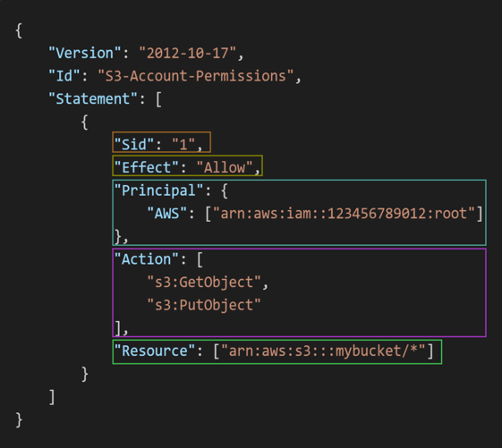

- IAM
  - 사용자를 생성하고 그룹을 할당할 수 있는 서비스
  - 그룹은 컨테이너 사용자만 가능하고 다른 그룹은 안 됨
  - 사용자나 그룹은 json 으로 정의
  - 사용자를 만들고 직접 권한을 주거나 그룹화 시켜서 줄 수 있음
  - iam 유저라면 오른쪽 상단에 표시가 됨
  - ex) 사용자 6명 생성
    - 3명 개발자
    - 2명 운영자
    - 1명은 어떤 그룹도 안 들어로 감
    - 각 그룹 한명씩 빼서 또 구룹을 만들 수 있음
  - 정책
    
    - `Version`: 정책 언어의 버전입니다. 항상 "2012-10-17"을 포함해야 합니다.
    - `Id`: 정책의 식별자입니다. 선택 사항입니다.
    - `Statement`: 하나 이상의 개별적인 명령문입니다. 필수 요소입니다.  각 `Statement`는 다음 요소로 구성됩니다:
      - `Sid`: 명령문의 식별자입니다. 선택 사항입니다.
      - `Effect`: 명령문이 접근을 허용하는지 아니면 거부하는지를 나타냅니다. (Allow, Deny)
      - `Principal`: 이 정책이 적용되는 계정/사용자/역할입니다.
      - `Action`: 이 정책이 허용하거나 거부하는 행동의 목록입니다.
      - `Resource`: 행동이 적용되는 리소스의 목록입니다.
      - `Condition`: 이 정책이 적용되는 조건입니다. 선택 사항입니다.
    - 비밀번호 정책
      - 최소 길이
      - 필요 패턴 설정
      - 비번바꾸기 한번
      - 비번 재사용 금지
    - mfa 설정
      - 사용자가 로그인 할 때마다 mfa 를 사용하도록 설정
- AWS CLI
  - 터미널 환경에서 cli 로 aws 서비스를 사용할 수 있음
  - aws configure 로 설정을 해줘야 함
  - aws iam list-users
  - aws iam create-user --user-name test
  - aws iam delete-user --user-name test
  - aws iam list-users
  - aws iam create-group --group-name test
  - aws iam add-user-to-group --group-name test --user-name test
  - aws iam list-groups
  - aws iam list-groups-for-user --user-name test
  - aws iam attach-group-policy --group-name test --policy-arn arn:aws:iam::aws:policy/AmazonEC2FullAccess
  - aws iam list-attached-group-policies --group-name test
  - 권한도 똑같이 설정 및 보여주기 가능
- CloudShell
  - aws cli 를 사용할 수 있는 웹 쉘 환경
  - 이미 로그인 되어 있음
- IAM Roles for AWS Services
  - iam과 비슷 하지만 물리적인게 아니라 aws 서비스에 사용하는 것
