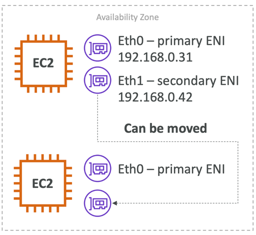
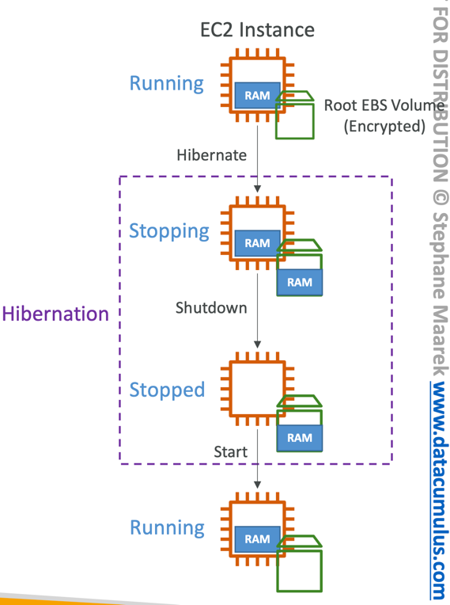

- private vs public
  - 내가 아는 그것
- placement groups
  - ec2를 어떻게 배치할 것인가
  - 클러스터
    - 같은 랙에 배치
    - 짧은 지연시간
  - 스프레드
    - 다른 랙에 배치
    - 7개의 그룹만 가능
    - 중요한 애플리케이션 끼리는 분리가 필요
  - 파티션
    - 최대 7개
    - 컨테이너 오류에 유리
- eni
  - primary private ip 하나 이상 가질 수 있음
  - 
    - 다른 ec2로 사설 ip를 옮기는 모습
    - 페일오버에 아주 유용함
- hibernate
  - 인스턴스를 중지하고 다시 시작하면 이전 상태로 돌아감
  - ebs 스토리지가 필요
  - 
