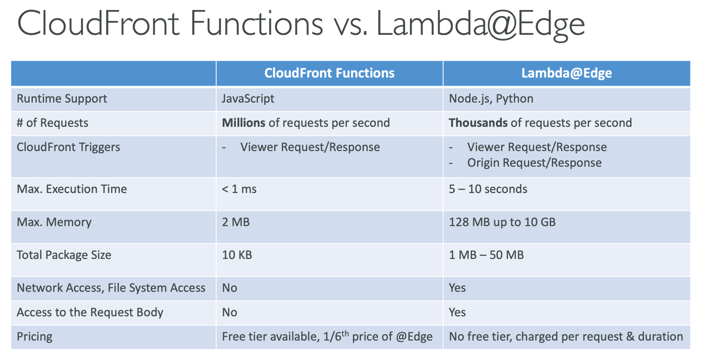

- lambda
    - 실행 할 때만 서버를 띄우는 서비스
    - 가격
        - 사용한 만큼만 비용을 지불
    - 지원언어
        - Node.js, Python, Ruby, Java, Go, .NET, PowerShell, Bash
    - api(rest로 호출) -> kinesis (데이터 변형) -> dynamoDB (저장) -> s3(파일 생성시 호출) -> cloudfront(파일 배포) -> cloudwatch event eventBridge(모니터링) -> sns(알림) -> sqs(큐) -> lambda(서버)
    - 한도
        - 메모리 128MB ~ 10GB(1 mb 단위로 증가)
        - 최대 실행시간 900초
        - 환경변수 4kb
        - 임시 저장 공간 512mb to 10gb
        - 최대 1000건 동시 처리
        - 배포시 50mb 제한(압축) 안 하면 250mb
    - snapStart
        - 미리 초기화를 해놓는 것
        - 무료
    - 람다 평션
        - 웹사이트 보안 // 보안
    - 클라우드 프런트
        - 캐시 서버
        - 전세계에 캐시 서버를 두고 사용자에게 가까운 서버로 데이터를 전송
        - 잔체 코드가 관리
    - 람다 엣지
        - 노드나 파이썬
        - 초당 1천개
    - 
    - vpc
        - 람다는 보안 그룹을 통해 vpc에 접근
        - rds에 직접 연결하지 않고 프록시를 통해서 한다. 너무 많은 연결 요청이 들어오면 람다가 죽을 수 있음
- dynamoDb
    - nosql
    - 오토스케일 기능
    - 테이블
        - 기본키
            - 해시키
            - 해시키 + 레인지키
        - 보조 인덱스
            - 로컬
            - 글로벌
    - dax (가속기)
      - 캐시 서버
          - 람다와 연결(클러스터)
      - dax vs elasticache
          - dax는 dynamoDB에 연결
          - elasticache는 rds에 연결
          - 서로 상호보완적인 관계
    
